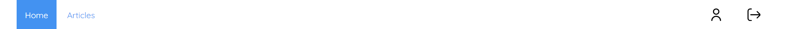

### docure-header

```js
npm i @specialdoom/docure-header
```

### usage

```html
<docure-header logosource="sourceForLogoImage">
  <a href="home">Home</a>
  <a href="about">About</a>
  <a href="contact" style="float: left;">Profile</a>
</docure-header>
```

### attributes
- _logosource_ absolute source for logo image

### notes
 - anyhting inside the body of the component is going to be displayed as a header navigation item
 - use floating right to display a navigation item to the right 

### example 

